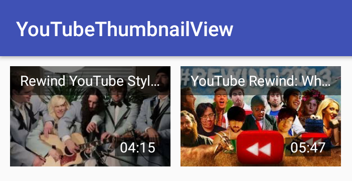

# YouTube Thumbnail View

[  ](https://bintray.com/codewaves/maven/youtube-thumbnail-view/_latestVersion)
[](https://travis-ci.org/Codewaves/YouTube-Thumbnail-View)
[](https://www.codacy.com/app/Codewaves/YouTube-Thumbnail-View?utm_source=github.com&amp;utm_medium=referral&amp;utm_content=Codewaves/YouTube-Thumbnail-View&amp;utm_campaign=Badge_Grade)
[](https://github.com/Codewaves/YouTube-Thumbnail-View/blob/master/LICENSE.txt)

YouTube thumbnail library. Library retrieves video information using YouTube links and displays it
as clickable thumbnail.



## Download

Download [the latest AAR][1] or grab via Gradle:
```groovy
compile 'com.codewaves.youtubethumbnailview:library:0.9.1'
```
or Maven:
```xml
<dependency>
  <groupId>com.codewaves.youtubethumbnailview</groupId>
  <artifactId>library</artifactId>
  <version>0.9.1</version>
</dependency>
```

## Usage

### Initialization

Initialize ThumbnailLoader. For example in your custom Application class. By default library 
uses Google API to retrieve information about video. You must set valid API key.
``` java
ThumbnailLoader.initialize("<GOOGLE API KEY>");
```

Another possibility is to use Oembed to retrieve video information. Unfortunately this will
not return information about video length. 
``` java
ThumbnailLoader.initialize()
      .setVideoInfoDownloader(new OembedVideoInfoDownloader());
```

You can use your own provider (or non documented method) to retrieve video information from 
YouTube url. Implement VideoInfoDownloader and set it as default info downloader.

### Simple loading

Add ThumbnailView into your layout xml file. When more than one thumbnail image are available, 
attribute minThumbnailWidth is used to select most appropriate candidate. Complete xml 
attribute list with default values:

``` xml
<com.codewaves.youtubethumbnailview.ThumbnailView android:id="@+id/thumbnail"
      android:layout_width="320dp"
      android:layout_height="180dp"
      android:background="@android:color/black"
      android:foreground="?android:attr/selectableItemBackground"
      app:youtube_minThumbnailWidth="320"
      app:youtube_titleVisible="true"
      app:youtube_titleTextSize="14sp"
      app:youtube_titleColor="@android:color/white"
      app:youtube_titleMaxLines="1"
      app:youtube_titleBackgroundColor="#80000000"
      app:youtube_titlePaddingBottom="5dp"
      app:youtube_titlePaddingTop="5dp"
      app:youtube_titlePaddingLeft="10dp"
      app:youtube_titlePaddingRight="10dp"
      app:youtube_timeVisible="true"
      app:youtube_timeTextSize="14sp"
      app:youtube_timeColor="@android:color/white"
      app:youtube_timeBackgroundColor="#80000000"
      app:youtube_timePaddingBottom="0dp"
      app:youtube_timePaddingTop="0dp"
      app:youtube_timePaddingLeft="5dp"
      app:youtube_timePaddingRight="5dp"
      app:youtube_timeMarginBottom="10dp"
      app:youtube_timeMarginRight="10dp"/>
```

and load thumbnail using YouTube video url.

``` java
thumbnailView.loadThumbnail("https://www.youtube.com/watch?v=iCkYw3cRwLo");
```

### Thumbnail image loaders

By default ThumbnailLoader uses very simple code to download images from the web. It
does not use any caching or advanced queueing. You are strongly advised to use image loading
library like Picasso or UIL.

``` java
thumbnailView.loadThumbnail("https://www.youtube.com/watch?v=H7jtC8vjXw8", new ImageLoader() {
   @Override
   public Bitmap load(String url) throws IOException {
      return Picasso.with(SampleActivity.this).load(url).get();
   }
});
```

or setting loader as default during ThumbnailLoader initialization

``` java
ThumbnailLoader.initialize()
      .setImageLoader(new ImageLoader() {
         @Override
         public Bitmap load(String url) throws IOException {
            return Picasso.with(getApplicationContext()).load(url).get();
      }
});
```

### Google API key

You can place your Google API key into application manifest file:

```
<application ...
   ...
   <meta-data android:name="com.codewaves.youtubethumbnailview.ApiKey"
      android:value="<GOOGLE API KEY>" />
   ...
</application>
```

and pass context to initialize function

``` java
ThumbnailLoader.initialize(getApplicationContext());
```

## Author

Sergej Kravcenko - [Codewaves][2]


## License

    The MIT License (MIT)

    Copyright (c) 2017 Sergej Kravcenko

    Permission is hereby granted, free of charge, to any person obtaining a copy
    of this software and associated documentation files (the "Software"), to deal
    in the Software without restriction, including without limitation the rights
    to use, copy, modify, merge, publish, distribute, sublicense, and/or sell
    copies of the Software, and to permit persons to whom the Software is
    furnished to do so, subject to the following conditions:

    The above copyright notice and this permission notice shall be included in all
    copies or substantial portions of the Software.

    THE SOFTWARE IS PROVIDED "AS IS", WITHOUT WARRANTY OF ANY KIND, EXPRESS OR
    IMPLIED, INCLUDING BUT NOT LIMITED TO THE WARRANTIES OF MERCHANTABILITY,
    FITNESS FOR A PARTICULAR PURPOSE AND NONINFRINGEMENT. IN NO EVENT SHALL THE
    AUTHORS OR COPYRIGHT HOLDERS BE LIABLE FOR ANY CLAIM, DAMAGES OR OTHER
    LIABILITY, WHETHER IN AN ACTION OF CONTRACT, TORT OR OTHERWISE, ARISING FROM,
    OUT OF OR IN CONNECTION WITH THE SOFTWARE OR THE USE OR OTHER DEALINGS IN THE
    SOFTWARE.

 [1]: https://bintray.com/codewaves/maven/youtube-thumbnail-view/_latestVersion
 [2]: http://www.codewaves.com